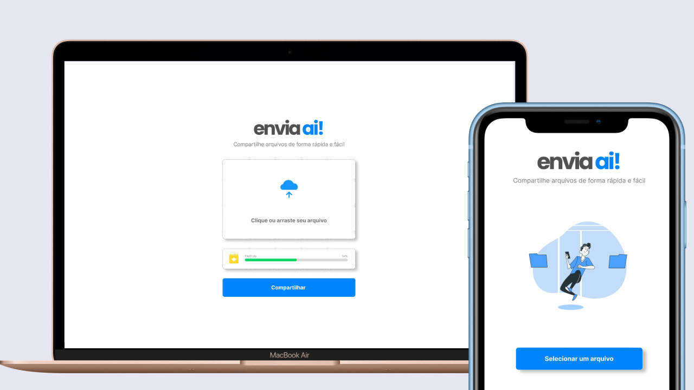

<h1 align="center">
    
    <h3 align="center">Compartilhamento de arquivos de forma fácil e rápida</h3>
</h1>
 
<h4 align="center"> 
🚀 Aplicação em construida para SECOMP 2022 🚀
</h4>

  

## 💻 Projeto

<b>envia ai</b> - compartilhar arquivos nunca ficou tão fácil
<h1 align="center">
    
</h1>